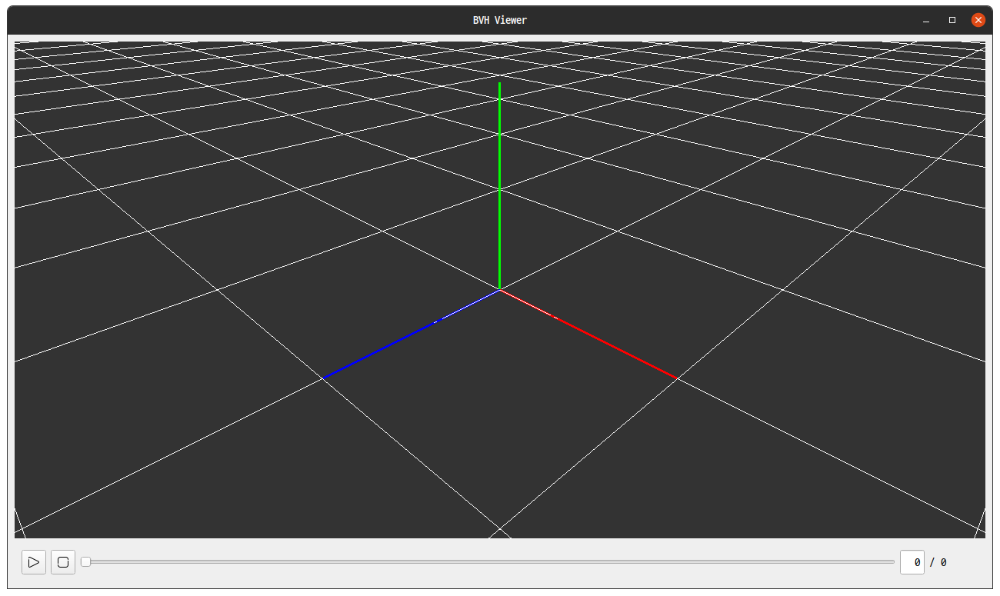
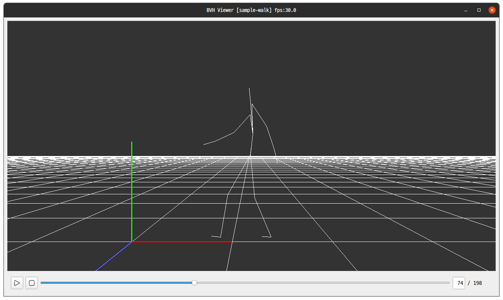

#Bvh Viewer

## Requirements

```bat
$pip3 install PyQt5 PyOpenGL typing re
```

## How to use

Run `python3 main.py`, and drag-drop bvh file. Only one file can be loaded at a time.

The fps may not be respected for files with a frame rate of 1 ms or less.

### Controls

Key mapping
  - R: reset target to (0,0,0) & zoom level to 3.0 .
  - F: follow / unfollow model's root joint.
  - V: on / off orthogonal view.
  - 1: set view direction ( 0, 0,-1) - view target from z axis.
  - 3: set view direction (-1, 0, 0) - view target from x axis.
  - 7: set view direction ( 0,-1, 0) - view target from y axis.
  - 9: set view direction ( 0, 1, 0) - view target from -y axis.
  - 5: set target to model root's current location.
  - 0: set view direction angle from zx plane as 30 degree, and from zy plane as 45 degree.
  - SPACE: play/pause animation.
  - ESC: stop animation.

## Running Examples


